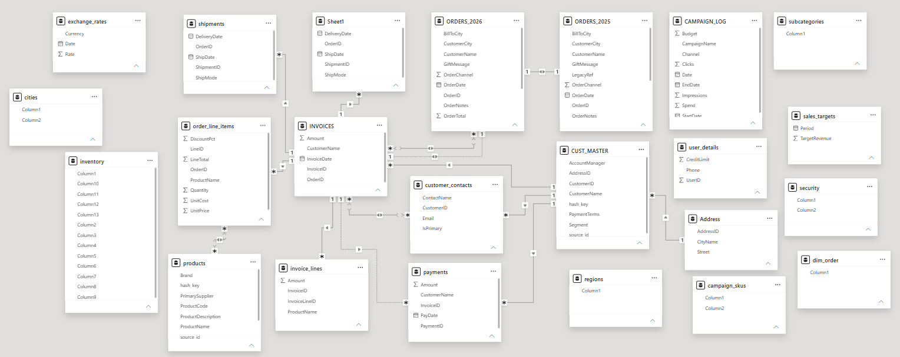
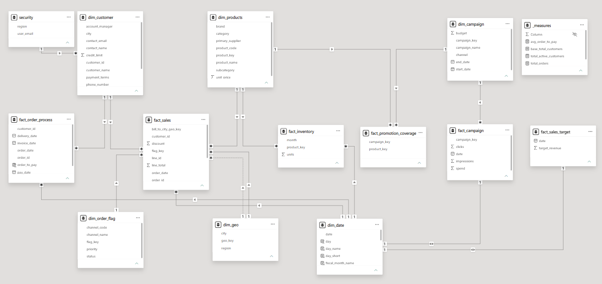

# Power BI Semantic Model Refactoring: From Legacy Model to Galaxy Schema

> Refactoring an existing Power BI semantic model into a clean, scalable, and enterprise-ready semantic model by applying dimensional modeling best practices.

---

# Project Overview

This project demonstrates the complete process of refactoring an existing Power BI semantic model. Instead of rebuilding the model from scratch, I analyzed the existing implementation, identified design issues, and incrementally transformed the model using dimensional modeling best practices.

The complete refactoring journey is documented step by step in this repository.

---

# The Challenge

The original semantic model had several design challenges:

- Duplicate descriptive data
- Complex relationships
- Inconsistent naming conventions
- Unnecessary columns
- Mixed business processes
- Difficult maintenance
- Limited scalability

These issues made the semantic model difficult to understand, maintain, and extend. The complex relationships also increased the risk of incorrect calculations and inconsistent reporting, reducing the reliability of business insights.

---

# Original Semantic Model

The image below shows the original semantic model before refactoring.

The goal of this project was to improve the semantic model while preserving the existing business logic.

---

# Refactoring Strategy

Rather than making all the changes at once, I improved the semantic model incrementally. Each phase focused on one area of the model, making it easier to validate changes and document the design decisions.

---

# Development Process

The semantic model was developed incrementally through the following phases.

---

## Phase 1 – Understanding the Existing Model

Before making any changes, I explored the existing semantic model to understand the business requirements, identify business entities, and evaluate the current design.

### What I did

- Explored every table in the semantic model.
- Identified business entities and transactional data.
- Reviewed existing relationships.
- Documented modeling issues and improvement opportunities.

📖 **Detailed documentation:**  
➡️ **[01 – Existing Model Analysis](docs/01_existing_model.md)**

---

## Phase 2 – Defining Modeling Standards

After understanding the existing model, I established consistent modeling standards to guide the refactoring process.

### What I did

- Defined table naming conventions.
- Standardized column naming.
- Planned relationship design.
- Established dimensional modeling guidelines.

📖 **Detailed documentation:**  
➡️ **[02 – Modeling Standards](docs/02_modeling_standards.md)**

---

## Phase 3 – Preparing and Exploring the Model

The semantic model was prepared by reviewing every query, organizing Power Query, and planning the target architecture.

### What I did

- Organized Power Query into logical folders.
- Reviewed every query.
- Removed unnecessary objects.
- Planned the target semantic model.

📖 **Detailed documentation:**  
➡️ **[03 – Prepare and Explore](docs/03_prepare_and_explore.md)**

---

## Phase 4 – Building Dimension Tables

The refactoring started by creating the core dimension tables required for the semantic model. As additional business processes were analyzed in later phases, more reusable dimensions were extracted from the existing tables and incorporated into the model.

### What I did

- Created the initial Customer and Product dimensions.
- Identified reusable descriptive attributes.
- Designed conformed dimensions.
- Added additional dimensions progressively during the refactoring process.

📖 **Detailed documentation:**  
➡️ **[04 – Building Dimensions](docs/04_dimensions.md)**

---

## Phase 5 – Building Fact Tables

The refactoring began by creating the Sales fact table as the primary transactional table. As additional business processes were analyzed, the remaining fact tables were extracted and refined throughout the refactoring process.

### What I did

- Built the initial Sales fact table.
- Defined the transaction grain.
- Established relationships with dimension tables.
- Extracted additional fact tables during later refactoring phases.

📖 **Detailed documentation:**  
➡️ **[05 – Building Fact Tables](docs/05_fact_sales.md)**

---

## Phase 6 – Continuing the Refactoring

After establishing the core dimension and fact tables, I continued refactoring the remaining parts of the semantic model. Additional dimensions and fact tables were extracted from the existing tables, relationships were refined, and the overall model was optimized for better scalability and maintainability.

### What I did

- Extracted additional dimension tables from the remaining business processes.
- Created the remaining fact tables as new business processes were identified.
- Refined relationships between dimensions and facts.
- Removed redundant columns and unnecessary relationships.
- Optimized the semantic model structure for better readability and performance.

📖 **Detailed documentation:**  
➡️ **[06 – Continuing Refactoring](docs/06_continuing_refactoring.md)**

---

## Phase 7 – Finalizing the Semantic Model

The final stage focused on completing and validating the semantic model.

### What I did

- Built a shared Date dimension.
- Created reusable DAX measures.
- Implemented Dynamic Row-Level Security.
- Validated the final semantic model.

📖 **Detailed documentation:**  
➡️ **[07 – Final Semantic Model](docs/07_final_model.md)**

---

## Phase 8 – Lessons Learned

The final phase summarizes the key concepts, best practices, and insights gained throughout the semantic model refactoring journey.

### What I learned

- Semantic model refactoring
- Dimensional modeling best practices
- Fact and dimension table design
- Star Schema and Galaxy Schema design
- Relationship optimization
- Power Query organization
- Reusable DAX measures
- Dynamic Row-Level Security (RLS)
- Building scalable semantic models
- Enterprise modeling best practices

📖 **Detailed documentation:**  
➡️ **[08 – Lessons Learned](docs/08_lessons_learned.md)**

---

## Final Semantic Model

The refactored semantic model follows a Galaxy Schema (Fact Constellation) with shared conformed dimensions and dedicated fact tables for each business process.

### Shared Dimensions

- dim_customer
- dim_products
- dim_geo
- dim_campaign
- dim_order_flag
- dim_date

### Fact Tables

- fact_sales
- fact_inventory
- fact_campaign
- fact_order_process
- fact_sales_target
- fact_promotion_coverage

The final design provides a cleaner semantic model with simplified relationships, reusable dimensions, centralized business logic, and improved scalability for analytical reporting.

---

# Conclusion

This project demonstrates how an existing semantic model can be transformed into a clean, scalable, and maintainable solution by applying dimensional modeling best practices. The detailed documentation in this repository captures every stage of the refactoring journey.

---

# Acknowledgements

The business scenario used in this project was inspired by a Power BI data modeling project by **Baraa**. The implementation, refactoring decisions, documentation, and repository organization were completed independently as part of my learning journey.
