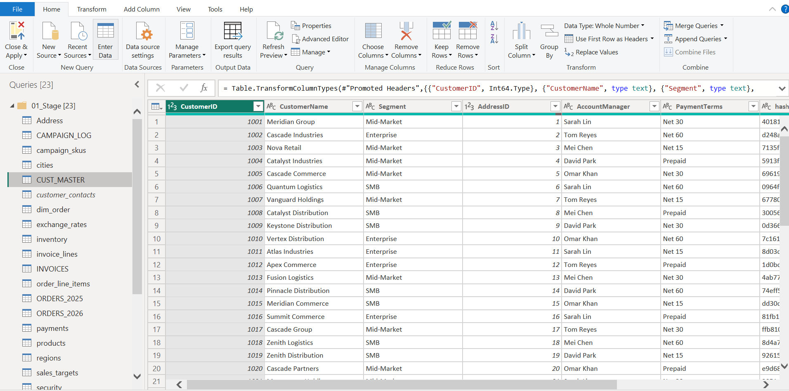
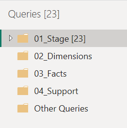

# Prepare and Explore

## Overview

With the current state of the semantic model understood and the modeling standards defined, the next step was to explore the existing data before making any structural changes.

The objective of this phase was to understand the business, identify the main business entities, and determine how the existing tables could be organized into a clean star schema.

---

## Understanding the Business

Before building dimensions and facts, I wanted to answer a few important questions:

- What business process does this data represent?
- What are the main business entities?
- Which tables describe those entities?
- Which tables record business transactions?

Understanding the answers to these questions helped me make informed modeling decisions instead of making changes based on assumptions.

---

## Exploring the Data

I reviewed every table in Power Query to understand its purpose and how it contributed to the business process.

During this exploration, I focused on identifying descriptive tables that could become dimensions and transactional tables that could become facts.

---

## Identifying Dimension Tables

From the exploration, I identified several descriptive tables that represent business entities.

These included:

- Customers
- Products
- Addresses
- Cities
- Regions
- Subcategories

These tables mainly contain descriptive attributes and will later be consolidated into clean dimension tables.

---

## Identifying Fact Tables

I also identified tables that capture business events and transactions.

Examples include:

- Orders
- Order Line Items
- Invoices
- Invoice Lines
- Payments
- Shipments
- Campaign Logs

These tables contain measurable business activity and will become the fact tables in the refactored semantic model.

---

## Planning the Refactoring

After understanding the available data, I had a clear picture of how the semantic model should be organized.

This planning phase helped me:

- Identify which tables belong together.
- Decide which tables would become dimensions.
- Identify the transactional tables that would become facts.
- Plan the order of the refactoring work.

Having this roadmap before making changes reduced the chances of unnecessary rework later in the project.

---

## Organizing the Workspace

Before starting the transformations, I organized the Power Query environment to keep the project structured.

I grouped the queries into logical folders so that the original source tables, dimensions, facts, and supporting queries would be easier to manage throughout the refactoring process.

---

## Summary

By the end of this phase, I had a solid understanding of the business domain, the available data, and the overall structure of the semantic model.

More importantly, I had a clear plan for building the dimension and fact tables while following the modeling standards defined earlier.

---

## What's Next

With the business entities identified and the refactoring plan in place, the next step is to begin building the dimension tables, starting with the Customer Dimension.

➡️ Continue to [04_dimensions.md](04_dimensions.md)
