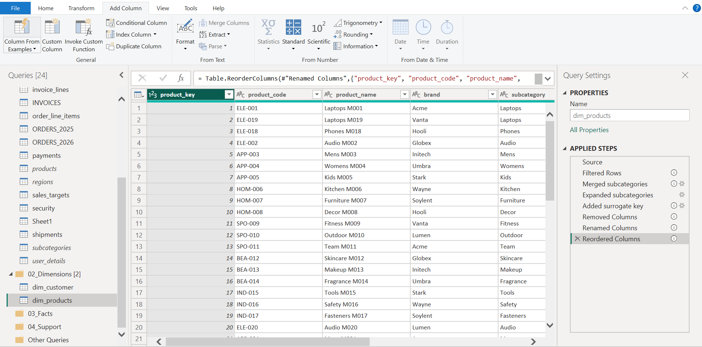

# Building Dimension Tables

## Overview

After exploring the existing data and identifying the main business entities, I started building the core dimension tables.

I began with the Customer and Product dimensions because they are shared across multiple business processes and will serve as the foundation of the semantic model.

The objective of this phase was to create clean and reusable dimension tables by removing unnecessary data, applying consistent naming standards, and introducing surrogate keys.

---

## Building the Customer Dimension

I started by creating the Customer dimension from the existing customer data.

During this process, I:

- Merged the customer contact information.
- Removed unnecessary and technical columns.
- Renamed the columns to follow the project's naming standards.
- Added a surrogate `customer_key`.
- Reordered the columns for better readability.

The completed Customer dimension is shown below.

---

## Building the Product Dimension

After completing the Customer dimension, I created the Product dimension.

During the transformation, I:

- Removed invalid and duplicate records.
- Merged the required product category information.
- Removed unnecessary columns.
- Added a surrogate `product_key`.
- Renamed the columns to follow the project's naming standards.
- Reordered the columns to maintain a consistent structure.

The completed Product dimension is shown below.

---

## Summary

By the end of this phase, I had created two clean and reusable dimension tables that follow consistent naming conventions and dimensional modeling best practices.

These dimensions provide the descriptive information required by the fact tables and form the foundation of the star schema.

---

## What's Next

With the core dimensions completed, the next step is to build the first fact table. During this phase, I will replace descriptive attributes with surrogate keys and create additional supporting dimensions wherever required.

➡️ Continue to [05_fact_sales.md](05_fact_sales.md)
