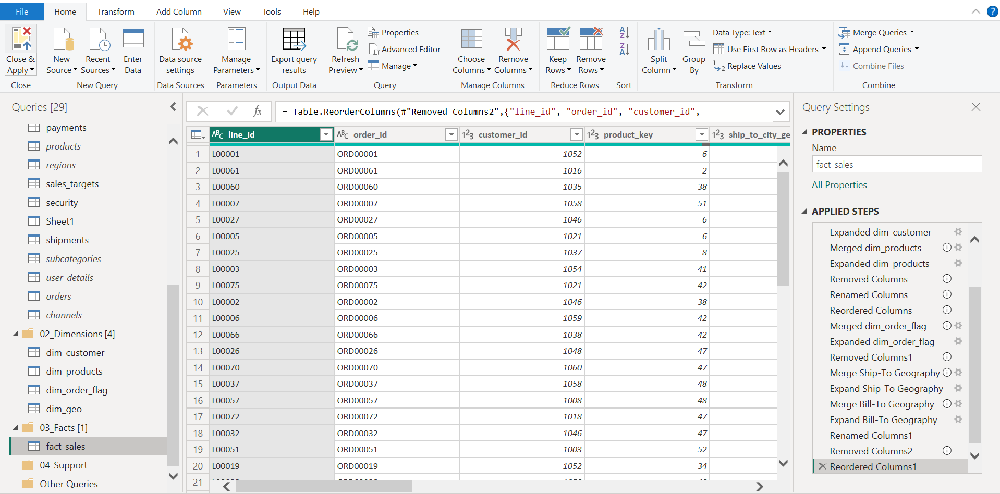

# Building the Sales Fact Table

## Overview

With the core dimension tables in place, the next step was to build the first fact table for the semantic model.

Instead of loading the transaction tables directly into the model, I transformed them into a clean fact table by replacing descriptive attributes with surrogate keys, removing redundant columns, and extracting additional dimensions wherever required.

The objective of this phase was to create a well-structured fact table that stores the business measures while using keys to connect with the dimension tables.

---

## Understanding the Transaction Data

Before building the fact table, I reviewed the sales-related transaction tables to understand their structure and level of detail.

This helped me identify the columns that should remain as business measures and the descriptive attributes that should be replaced with dimension keys.

---

## Building the Sales Fact

I created the `fact_sales` table by transforming the sales transaction data and integrating it with the dimension tables created during the previous phase.

During this process, I:

- Combined the required transaction data.
- Merged the order information into the fact table.
- Replaced customer attributes with the `customer_key`.
- Replaced product attributes with the `product_key`.
- Created the `dim_order_flag` dimension and added the `flag_key`.
- Created the `dim_geo` dimension and added the `ship_to_geo_key` and `bill_to_geo_key`.
- Removed descriptive columns after replacing them with dimension keys.
- Renamed the columns to follow the project's naming standards.
- Reordered the columns to improve readability.

The completed Power Query transformation is shown below.

---

## Updating the Semantic Model

After completing the `fact_sales` table, I connected it with the dimension tables using the surrogate keys created during the refactoring process.

At this stage, the semantic model started taking the shape of a star schema, with the fact table connected to the dimensions built so far.

The updated semantic model is shown below.

---

## Summary

By the end of this phase, I had completed the first fact table and connected it to the existing dimensions using surrogate keys.

This significantly reduced data redundancy, improved the overall structure of the semantic model, and established a solid foundation for continuing the refactoring process.

---

## What's Next

With the first fact table completed, the next step is to continue refactoring the remaining transaction tables, extract additional dimensions wherever required, and complete the semantic model.

➡️ Continue to [06_remaining_dimensions.md](06_remaining_dimensions.md)
