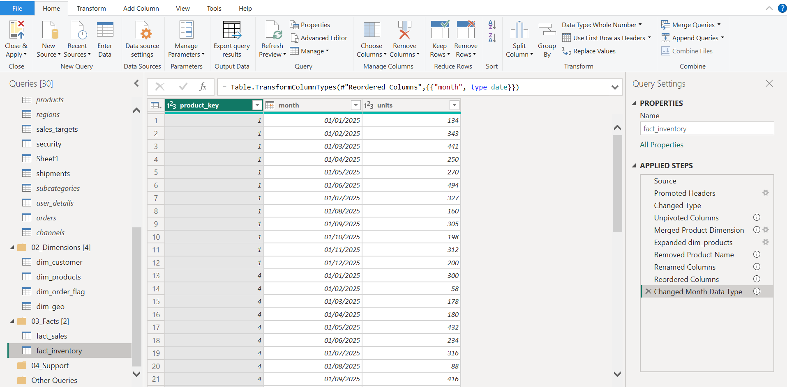
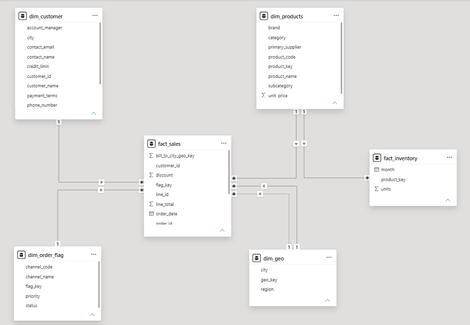
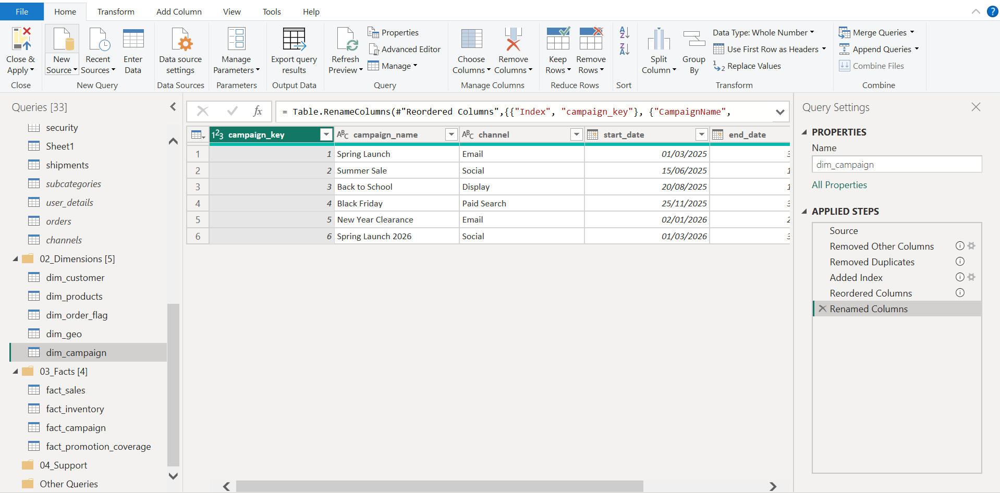
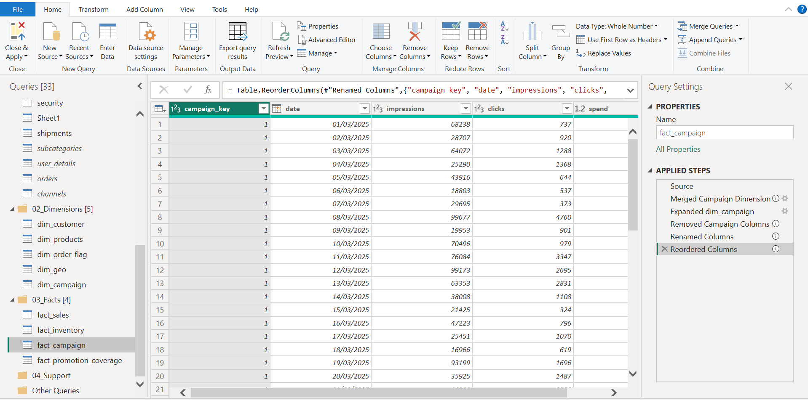
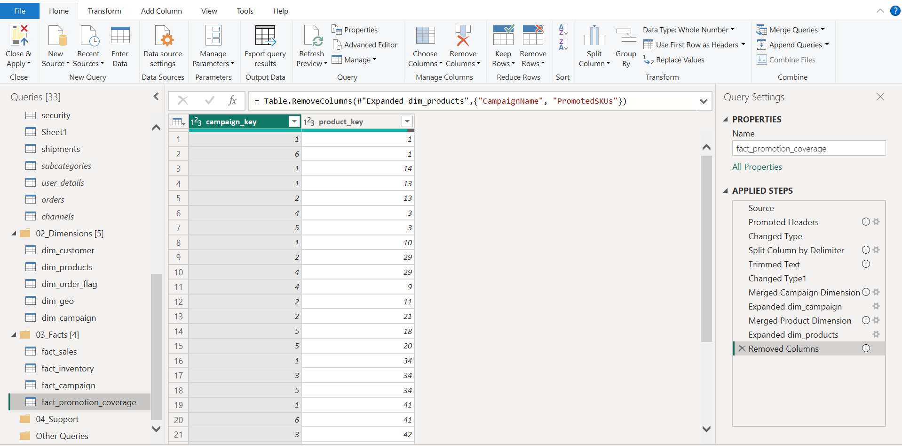
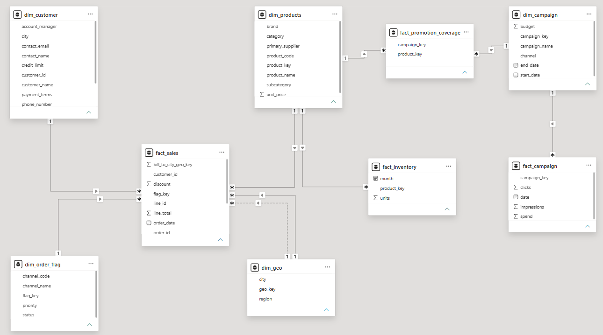

# Continuing the Refactoring

## Overview

After completing the `fact_sales` table, I continued refactoring the remaining tables in the semantic model.

During this phase, I focused on building additional fact and dimension tables, integrating them with the existing model, and improving the overall star schema.

---

## Building the Inventory Fact

The inventory data contains the planned inventory units for each product on a monthly basis. Since the table stores measurable business data over time, I modelled it as a fact table.

To prepare the `fact_inventory` table, I:

- Promoted the first row as column headers.
- Unpivoted the monthly inventory columns into rows so that each record represents the inventory units for a single product and month.
- Changed the `month` column data type to Date.
- Merged the `dim_products` table to retrieve the `product_key`.
- Expanded the `product_key` column from the merged table.
- Removed the `product_name` column after replacing it with the `product_key`.
- Renamed the columns to follow the project's modeling standards and improve consistency.
- Reordered the columns to improve readability and maintain a consistent column layout.

The completed Power Query transformation is shown below.

---

## Updating the Semantic Model

After creating the `fact_inventory` table, I connected it to the existing `dim_products` table using the `product_key`.

The updated semantic model is shown below.

---

## Summary

**The semantic model now includes an additional fact table for inventory data. By reusing the existing product dimension, the model remains consistent, reduces data duplication, and supports inventory analysis alongside sales data.**

---

## Building the Campaign Model

The campaign data included both descriptive information about each campaign and daily campaign performance. To create a scalable semantic model, I separated the descriptive attributes into a dimension table and the transactional data into a fact table.

I also created a factless fact table to map campaigns with the products included in each campaign.

---

### Building the Campaign Dimension

I created the `dim_campaign` table by:

- Removing the transaction-related columns.
- Removing duplicate records so that each campaign appears only once.
- Adding an index column to create the `campaign_key`.
- Renaming the columns to follow the project's modeling standards and improve consistency.
- Reordering the columns to improve readability and maintain a consistent column layout.

The completed Power Query transformation is shown below.

---

### Building the Campaign Fact

I created the `fact_campaign` table by:

- Merging the `dim_campaign` table to retrieve the `campaign_key`.
- Expanding the `campaign_key` column from the merged table.
- Removing the campaign-related columns after replacing them with the `campaign_key`.
- Renaming the columns to follow the project's modeling standards and improve consistency.
- Reordering the columns to improve readability and maintain a consistent column layout.

The completed Power Query transformation is shown below.

---

### Building the Promotion Coverage Table

The promotion coverage data defines which products belong to each campaign. Since this table contains only keys and no business measures, I modelled it as a factless fact table.

To prepare the `fact_promotion_coverage` table, I:

- Promoted the first row to use the column values as headers.
- Updated the data types of the columns.
- Split the product list into separate rows using the delimiter.
- Removed leading and trailing spaces from the product values.
- Updated the data types after splitting the values.
- Merged the `dim_campaign` table to retrieve the `campaign_key`.
- Expanded the `campaign_key` column from the merged table.
- Merged the `dim_products` table to retrieve the `product_key`.
- Expanded the `product_key` column from the merged table.
- Removed the original campaign and product columns after replacing them with the corresponding dimension keys.

The completed Power Query transformation is shown below.

---

### Updating the Semantic Model

After completing the campaign model, I connected the campaign dimension with both the campaign fact table and the promotion coverage table using the `campaign_key`.

The promotion coverage table also connects to the product dimension through the `product_key`, allowing campaigns and products to be analysed together without duplicating data.

The updated semantic model is shown below.

---

## Summary

By the end of this phase, I had completed the campaign dimension, campaign fact table, and promotion coverage table. These additions expanded the semantic model, enabled campaign and product analysis, and maintained a clean and scalable star schema.

---
