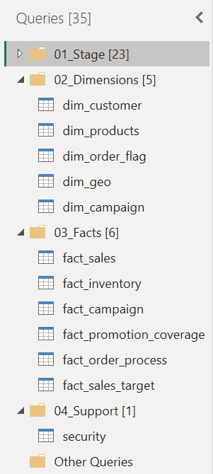
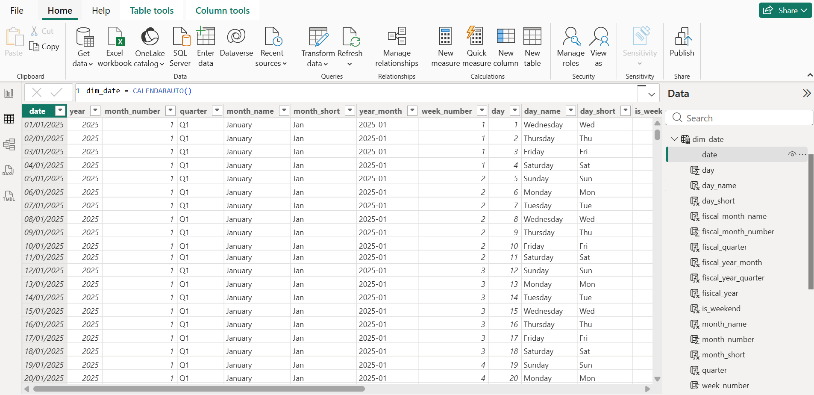
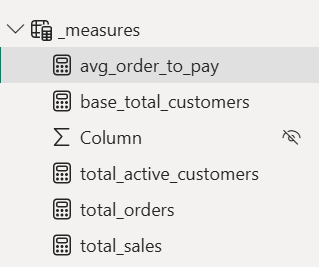
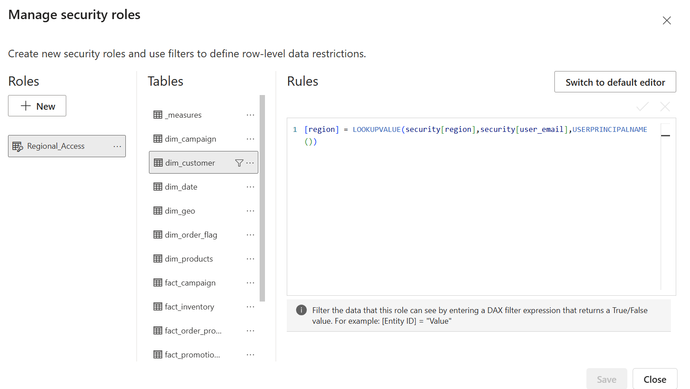

# Finalizing the Semantic Model

## Overview

After completing the dimensions and fact tables, I performed a final review of the semantic model to ensure it followed the project's modeling standards and was ready for reporting.

During this phase, I standardized the model, created a shared date dimension, added reusable business measures, prepared the security model, and validated the completed semantic model before considering the refactoring complete.

---

## Reviewing the Modeling Standards

Before finalizing the model, I reviewed every table and column to ensure they followed the project's modeling standards.

During this review, I:

- Verified the naming conventions for all tables.
- Corrected any remaining column names.
- Confirmed that all dimension and fact tables followed the required prefixes.
- Standardized the display format for all date columns.
- Reviewed numeric columns and adjusted their default summarization where appropriate.

This final review ensured the semantic model remained clean, consistent, and easy to use.

---

## Building the Date Dimension

To support time-based analysis across multiple business processes, I created a shared `dim_date` table using the `CALENDARAUTO()` function.

The date dimension automatically generates the required date range based on the dates available in the semantic model.

I also added commonly used calendar attributes, including:

- Year
- Month

The completed date dimension was then connected to the relevant fact tables, allowing multiple business processes to be analysed using the same calendar.

---

## Creating Core Measures

To provide consistent business calculations, I created a dedicated measures table containing reusable DAX measures.

Examples include:

- Total Sales
- Total Orders
- Total Customers
- Total Active Customers
- Average Order-to-Pay Days

Providing these core measures helps ensure that reports reuse the same business logic throughout the semantic model.

---

## Preparing Row-Level Security

To support secure reporting, I prepared the semantic model for Row-Level Security (RLS).

The security table stores the relationship between users and business regions, allowing access to be restricted based on user permissions.

After validating the relationships, the model was ready for implementing dynamic security.

---

## Final Validation

Before completing the project, I performed a final validation of the semantic model by:

- Reviewing relationships
- Verifying filter directions
- Checking major business measures
- Validating the date dimension
- Confirming the model followed the required standards

After validation, the semantic model was ready for reporting and future development.

---

## Final Semantic Model

The completed semantic model contains multiple fact tables connected through shared conformed dimensions, forming a Galaxy Schema (Fact Constellation).

The final semantic model is shown below.

---

## Summary

By the end of this project, I transformed a complex and poorly structured semantic model into a clean Galaxy Schema consisting of multiple star schemas connected through shared dimensions. The completed model follows dimensional modeling best practices, supports multiple business processes, and provides a scalable foundation for Power BI reporting.
