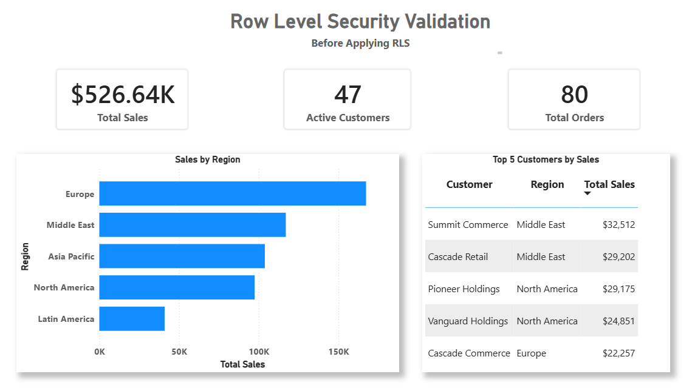
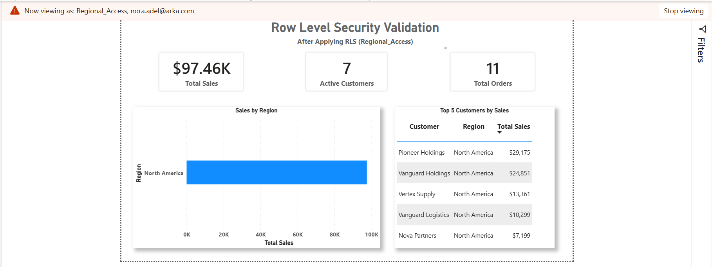

# Finalizing the Semantic Model

## Overview

After completing the dimensions and fact tables, I performed a final review of the semantic model to ensure it followed the project's modeling standards and was ready for reporting.

During this phase, I standardized the model, created a shared date dimension, added reusable business measures, implemented dynamic Row-Level Security (RLS), and validated the completed semantic model before considering the refactoring complete.

---

## Reviewing the Modeling Standards

Before finalizing the model, I reviewed every table and column to ensure they followed the project's modeling standards.

During this review, I:

- Verified the naming conventions for all tables.
- Corrected any remaining column names.
- Confirmed that all dimension and fact tables followed the required prefixes.
- Standardized the display format for date, numeric, and currency columns.
- Reviewed numeric columns and adjusted their default summarization where appropriate.
- Confirmed that relationships, hierarchies, and table organization were consistent across the semantic model.

This final review ensured the semantic model remained clean, consistent, and easy to use.

---

## Building the Date Dimension

To support time-based analysis across multiple business processes, I created a shared `dim_date` table using the `CALENDARAUTO()` function.

The date dimension automatically generates the required date range based on the dates available in the semantic model, making it scalable as new data is added.

I enriched the table with both calendar and fiscal attributes to support different reporting requirements.

The calendar attributes include:

- Date
- Year
- Quarter
- Month Number
- Month Name
- Month Short Name
- Year-Month
- Week Number
- Day
- Day Name
- Day Short Name
- Is Weekend

To support financial reporting, I also added fiscal attributes, including:

- Fiscal Year
- Fiscal Quarter
- Fiscal Month Number
- Fiscal Month Name
- Fiscal Year-Month
- Fiscal Year-Quarter

Finally, I connected the shared date dimension to the relevant fact tables, enabling consistent time-based analysis across multiple business processes while supporting both calendar and fiscal reporting.

---

## Creating Core Measures

To provide consistent business calculations, I created a dedicated `_Measures` table containing reusable DAX measures.

Examples include:

- Total Sales
- Total Orders
- Total Customers
- Active Customers
- Average Order-to-Pay Days

Centralizing these measures ensures that reports reuse the same business logic throughout the semantic model while improving maintainability and reducing duplication.

---

## Implementing Row-Level Security

To support secure reporting, I implemented dynamic Row-Level Security (RLS).

A dedicated security table stores the mapping between users and their assigned business regions. Using the `USERPRINCIPALNAME()` function, the logged-in user's email address is matched with the security table to determine the region they are authorized to access.

This dynamic approach allows the same security role to be reused for all users without creating separate roles for each region.

The security configuration is shown below.

To validate the implementation, I created a simple dashboard containing key business metrics, regional sales, and top customers.

Before applying the security role, the dashboard displays data from all business regions.

Using **View As** with the `Regional_Access` role automatically filters the dashboard so that users can only view data for their assigned region.

---

## Final Validation

Before completing the project, I performed a final validation of the semantic model by:

- Reviewing table relationships.
- Verifying relationship directions and cardinality.
- Validating the shared date dimension.
- Testing reusable business measures.
- Verifying dynamic Row-Level Security.
- Confirming that the semantic model followed the required modeling standards.

After validation, the semantic model was ready for reporting and future development.

---

## Final Semantic Model

The completed semantic model contains multiple fact tables connected through shared conformed dimensions, forming a **Galaxy Schema (Fact Constellation)**.

The final semantic model is shown below.

---

## Summary

By the end of this project, I transformed a complex and poorly structured semantic model into a clean Galaxy Schema consisting of multiple star schemas connected through shared conformed dimensions.

The completed semantic model includes reusable dimensions, multiple fact tables, a shared date dimension with calendar and fiscal attributes, centralized DAX measures, and dynamic Row-Level Security. The final model follows dimensional modeling best practices and provides a scalable, maintainable, and secure foundation for Power BI reporting.
